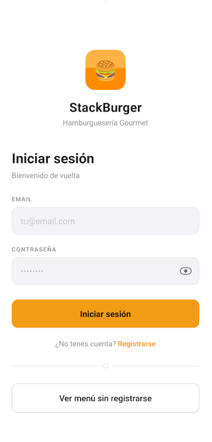
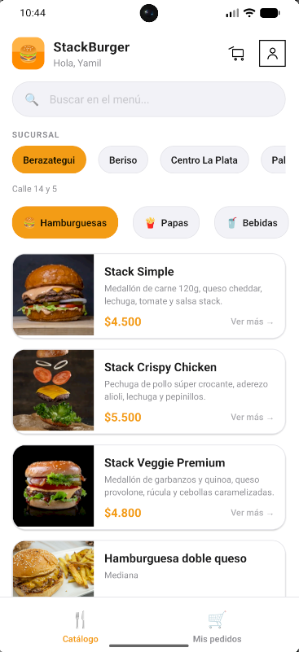
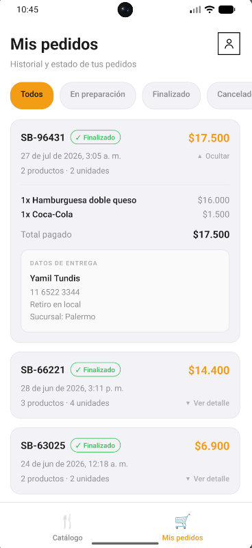
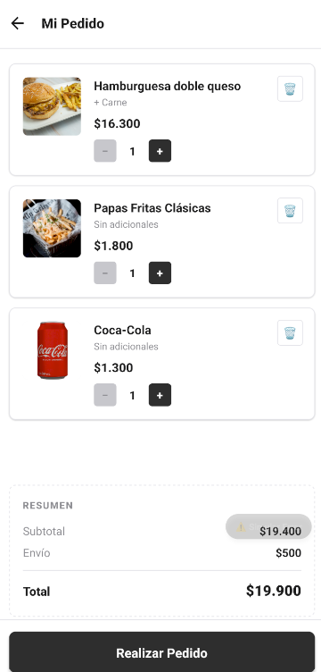
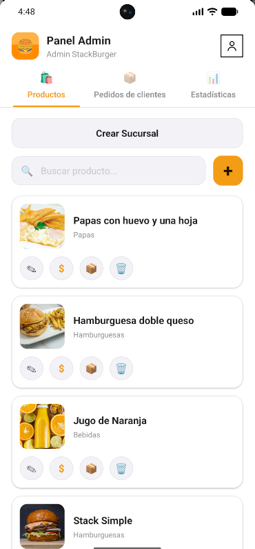
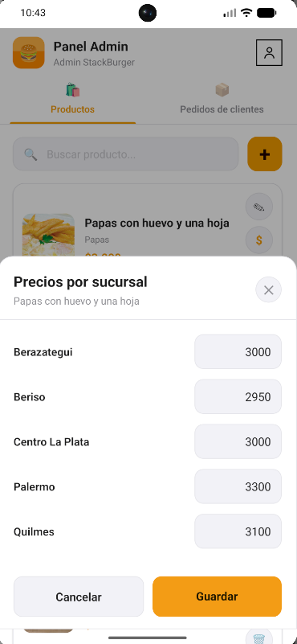
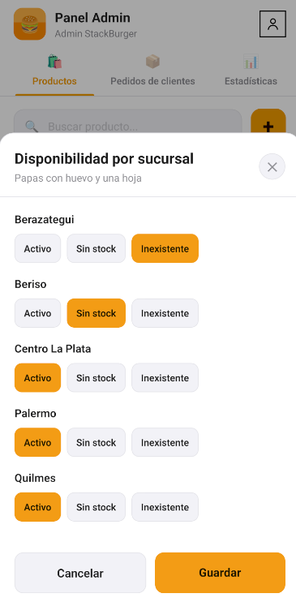
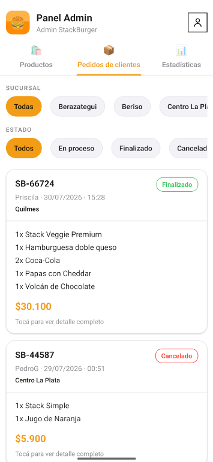
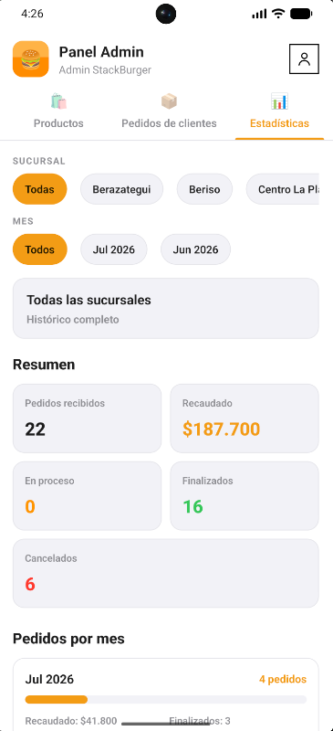

# StackBurger App

> Aplicación móvil de pedidos para delivery & takeaway — React Native  
> Proyecto Integrador · Desarrollo de Aplicaciones Móviles · 2026

## 👥 Integrantes


| Nombre            | GitHub                                               |
| ----------------- | ---------------------------------------------------- |
| *Yamil Tundis*    | [@yamiltundis](https://github.com/yamiltundis)       |
| *Julian Figueira* | [@JulianFigueira](https://github.com/JulianFigueira) |
| *Joaquin Montes*  | [@joaquingmontes](https://github.com/joaquingmontes) |
| *Jeronimo Molina* | [@usuario](https://github.com/usuario)               |
| *Leonel Piquet*   | [@LeonelPiquet](https://github.com/LeonelPiquet)     |

---

## 📋 Descripción

**StackBurger** es una aplicación móvil que permite a los clientes explorar el menú de una hamburguesería, personalizar sus pedidos y confirmarlos sin necesidad de hacer fila en el local. Desarrollada con React Native para Android.

El proyecto se construye de forma incremental en **3 entregas**:


| Entrega                     | Alcance                                                                    | Estado      |
| --------------------------- | -------------------------------------------------------------------------- | ----------- |
| **E1 — MVP Básico**         | Catálogo, carrito y confirmación de pedido                                 | ✅ Entregado |
| **E2 — Escalado funcional** | Autenticación, historial, categorías, rol admin y persistencia en Firebase | ✅ Entregado |
| **E3 — Producto final**     | Multi-sucursal, precios por sucursal, estadísticas y panel admin completo  | ✅ Entregado |


---


## 🚀 Funcionalidades


### E1 — MVP Básico

- 📖 **Catálogo de productos** — listado visual con foto, nombre, descripción y precio
- ⚙️ **Personalización** — cantidad de medallones, extras y aclaraciones especiales
- 🛒 **Carrito** — agregar, modificar y eliminar ítems con total actualizado en tiempo real
- 📝 **Formulario de pedido** — datos del cliente con validación de campos obligatorios
- ✅ **Confirmación** — pantalla de éxito que simula el registro del pedido en el servidor


### E2 — Escalado funcional

- 🔐 **Autenticación** — registro, inicio y cierre de sesión con Firebase Auth
- 👤 **Modo invitado** — navegación del menú sin cuenta; login requerido para agregar al carrito
- 🍔 **Menú por categorías** — hamburguesas, papas, bebidas y postres con filtro por nombre
- 📋 **Mis pedidos** — historial del cliente con estado y detalle expandible/colapsable
- 🚚 **Modalidad de entrega** — delivery o takeaway al confirmar el pedido
- 👨‍💼 **Rol administrador** — panel de productos (CRUD) y pedidos de clientes
- 🔄 **Gestión de pedidos** — creación, edición, eliminación y cambio de estado en tiempo real
- ☁️ **Persistencia en la nube** — usuarios, productos y pedidos en Firebase Data Connect + PostgreSQL
- 🖼️ **Imágenes de productos** — carga por URL desde el panel admin
- 🎨 **Tema claro unificado** — diseño consistente en todas las pantallas cliente y admin


### E3 — Producto final

- 🏪 **Multi-sucursal** — 5 locales iniciales con posibilidad de crear nuevos desde admin
- 📍 **Selección obligatoria de sucursal** — modal al ingresar como cliente; selector en catálogo
- 💰 **Precio por sucursal** — cada producto puede tener un precio distinto según el local (`ProductoSucursal`)
- 📦 **Disponibilidad por sucursal** — estados Activo, Sin stock e Inexistente con feedback en UI
- 🛒 **Carrito y checkout contextual** — precios y pedidos asociados a la sucursal activa
- 🔎 **Filtros admin** — pedidos filtrables por sucursal y por estado (En proceso, Finalizado, Cancelado)
- 📊 **Estadísticas del negocio** — totales por mes, recaudación, desglose por estado, gráfico de horarios pico y ranking entre sucursales
- ➕ **Crear sucursal** — alta desde admin con precios base y estado Activo por defecto en todos los productos
- ✅ **Validaciones de formularios** — campos obligatorios, formatos y tipos de dato en pantallas de carga

---

## 📸 Capturas de pantalla

Vistas principales de la aplicación. Las imágenes se guardan en `ia/screenshots/`; reemplazá cada archivo o actualizá la ruta en el markdown si usás otro nombre.

> **Cómo agregar las fotos:** exportá capturas desde el emulador o dispositivo, guardalas en la carpeta indicada y verificá que el nombre coincida con la ruta de abajo.

### Acceso

| Login |
| :---: |
| *Pantalla de inicio de sesión y registro* |
|  |

### Cliente

| Catálogo | Mis pedidos |
| :---: | :---: |
| *Menú por categorías y selector de sucursal* | *Historial de pedidos del usuario* |
|  |  |

| Carrito |
| :---: |
| *Ítems agregados y total antes de confirmar* |
|  |

### Administrador

| Productos | Precios por sucursal |
| :---: | :---: |
| *Listado y gestión del menú* | *Modal de edición de precio por local* |
|  |  |

| Disponibilidad por sucursal | Pedidos de clientes |
| :---: | :---: |
| *Modal de estado Activo / Sin stock / Inexistente* | *Listado de pedidos con filtros* |
|  |  |

| Estadísticas |
| :---: |
| *Panel de métricas, gráficos y ranking entre sucursales* |
|  |


---

## 🛠️ Tecnologías


| Herramienta           | Versión               | Uso                             |
| --------------------- | --------------------- | ------------------------------- |
| React Native          | 0.85.3                | Framework principal             |
| React                 | 19.2.x                | Biblioteca UI                   |
| Node.js               | 18+                   | Entorno de ejecución            |
| Firebase Auth         | 12.x                  | Autenticación de usuarios       |
| Firebase Data Connect | —                     | API GraphQL hacia PostgreSQL    |
| TanStack React Query  | 5.x                   | Caché y sincronización de datos |
| React Navigation      | 7.x                   | Navegación (Stack Navigator)    |
| Android SDK           | API 24+ (Android 7.0) | Plataforma objetivo             |


> **Gestión de estado:** Context API (Auth, Cart, Sucursal) + TanStack React Query  
> **Backend:** Firebase Data Connect + PostgreSQL (Cloud SQL)

---


## ⚙️ Requisitos previos

Antes de clonar y correr el proyecto, asegurate de tener instalado:

- [Node.js 18+](https://nodejs.org/)
- [Android Studio](https://developer.android.com/studio) con SDK API 24+
- [JDK 17](https://adoptium.net/)
- Variables de entorno `ANDROID_HOME` y `JAVA_HOME` configuradas
- Proyecto Firebase configurado (Auth + Data Connect) para E2/E3

Podés verificar tu entorno con:

```bash
npx react-native doctor
```

---


## 📦 Instalación

```bash
# 1. Clonar el repositorio
git clone https://github.com/joaquingmontes/SBURGER.git
cd SBURGER

# 2. Instalar dependencias de la app
cd app
npm install

# 3. Configurar Firebase (copiar plantillas y completar credenciales)
# Ver firebaseConfig.example.ts y dataconnect.example/

# 4. Iniciar el servidor Metro
npm start
```

---


## ▶️ Correr la app


### En emulador Android

```bash
# Desde la carpeta app/, con el emulador abierto desde Android Studio:
npm run android
```


### En dispositivo físico

1. Activar **Opciones de desarrollador** en el dispositivo
2. Habilitar **Depuración USB**
3. Conectar el dispositivo por cable USB
4. Ejecutar:

```bash
npm run android
```

---


## 📁 Estructura del proyecto

```
SBURGER/
├── app/                              # Aplicación React Native
│   ├── android/                      # Proyecto nativo Android
│   ├── ios/                          # Proyecto nativo iOS
│   ├── src/
│   │   ├── components/               # Componentes reutilizables
│   │   │   └── admin/                # UI del panel administrador
│   │   ├── config/                   # Firebase, React Query
│   │   ├── constants/                # Colores, mocks, temas admin
│   │   ├── context/                  # AuthContext, CartContext, SucursalContext
│   │   ├── hooks/                    # Hooks personalizados
│   │   ├── navigation/               # AppNavigator, guards por rol
│   │   ├── screens/                  # Pantallas cliente y admin
│   │   ├── services/                 # orderService, productoSucursalService
│   │   └── utils/                    # Mappers, caché, validaciones
│   ├── App.tsx
│   └── package.json
├── dataconnect.example/              # Plantilla: schema, queries, mutations y seeds
├── documentacion/
│   └── entrega1/                     # Alcance, doc. técnica y diseños Figma (E1)
├── ia/
│   ├── entrega-1/                    # Conversaciones con IA — E1
│   ├── entrega-2/                    # Conversaciones con IA — E2
│   ├── entrega-3/                    # Conversaciones con IA — E3
│   ├── conversaciones_finales.md     # Rejunte consolidado de las 3 entregas
│   └── readme.md                     # Este archivo
├── screenshots/
|   ├── login.png
|   ├── cliente-catalogo.png
|   ├── cliente-mis-pedidos.png
|   ├── cliente-carrito.png
|   ├── admin-productos.png
|   ├── admin-precios-sucursal.png
|   ├── admin-disponibilidad-sucursal.png
|   ├── admin-pedidos.png
|   └── admin-estadisticas.png
├── scripts/                          # Emulador, seed Firebase, generación de SDK
├── firebase.json.example
├── storage.rules.example
└── README.md                         # Changelog de la Entrega 2
```

---


## 🌿 Ramas


| Rama        | Descripción                                                                  |
| ----------- | ---------------------------------------------------------------------------- |
| `main`      | Código estable de referencia                                                 |
| `entrega-1` | Tag de la Entrega 1 — MVP con catálogo, carrito y confirmación local         |
| `entrega-2` | Entrega 2 — Auth, categorías, historial, admin y persistencia en Firebase    |
| `entrega-3` | Entrega 3 — Multi-sucursal, precios por local, estadísticas y producto final |


> Cada rama corresponde a un hito de entrega. Para trabajar sobre la versión más completa, usar `entrega-3`.

---


## 🔐 Variables de entorno

El proyecto no usa credenciales hardcodeadas. Copiá los archivos de ejemplo y completá los valores necesarios:

```bash
# Config Firebase de la app
cp app/src/config/firebaseConfig.example.ts app/src/config/firebaseConfig.ts

# Backend Data Connect (en ramas E2/E3)
cp -r dataconnect.example dataconnect
cp firebase.json.example firebase.json
```

---


## 👥 Integrantes


| Nombre            | GitHub                                               |
| ----------------- | ---------------------------------------------------- |
| *Yamil Tundis*    | [@yamiltundis](https://github.com/yamiltundis)       |
| *Julian Figueira* | [@JulianFigueira](https://github.com/JulianFigueira) |
| *Joaquin Montes*  | [@joaquingmontes](https://github.com/joaquingmontes) |
| *Jeronimo Molina* | [@usuario](https://github.com/usuario)               |
| *Leonel Piquet*   | [@LeonelPiquet](https://github.com/LeonelPiquet)     |


---


## 🤖 Uso de IA

Este proyecto documenta el uso de asistentes de IA como parte de los requisitos de la cátedra. Las conversaciones completas están registradas en la carpeta `/ia/`.


| Entrega | Asistente utilizado              | Archivo                          |
| ------- | -------------------------------- | -------------------------------- |
| E1      | Google DeepMind                  | `ia/entrega-1/conversaciones.md` |
| E2      | Cursor (Asistente de Desarrollo) | `ia/entrega-2/conversaciones.md` |
| E3      | Cursor (Asistente de Desarrollo) | `ia/entrega-3/conversaciones.md` |
| —       | Consolidado E1 + E2 + E3         | `ia/conversaciones_finales.md`   |


Cada archivo incluye un **índice de temas consultados** con enlaces a las consultas relevantes: setup del proyecto, integración Firebase, panel admin, multi-sucursal, estadísticas, entre otros.

La IA se utilizó principalmente para: definición de stack y estructura (E1), implementación de pantallas y flujos de UI (E2), integración con Firebase Data Connect (E2/E3), resolución de bugs de caché y sincronización, y diseño del modelo multi-sucursal (E3).

---


## 📄 Documentación


| Archivo / carpeta                                | Descripción                                                         |
| ------------------------------------------------ | ------------------------------------------------------------------- |
| `documentacion/entrega1/alcance_e1.pdf`          | Documento de alcance E1 — RF, RNF, reglas de negocio, user stories  |
| `documentacion/entrega1/doc_tecnica_e1.pdf`      | Documentación técnica de la Entrega 1                               |
| `documentacion/entrega1/figma/Wireframes.pdf`    | Wireframes del diseño inicial                                       |
| `documentacion/entrega1/figma/MockUps.pdf`       | Mockups de alta fidelidad                                           |
| `documentacion/entrega1/diagrama_navegacion.png` | Diagrama de navegación de la app                                    |
| `README.md` (raíz)                               | Changelog y comparativa E1 vs E2                                    |
| `ia/entrega-1/conversaciones.md`                 | Registro de interacciones con IA — E1 (5 consultas indexadas)       |
| `ia/entrega-2/conversaciones.md`                 | Registro de interacciones con IA — E2 (10 consultas indexadas)      |
| `ia/entrega-3/conversaciones.md`                 | Registro de interacciones con IA — E3 (10 consultas indexadas)      |
| `ia/conversaciones_finales.md`                   | Rejunte consolidado de las 25 consultas y transcripciones completas |
| `dataconnect.example/`                           | Schema GraphQL, queries, mutations y scripts de seed de referencia  |


---

**Materia:** Desarrollo de Aplicaciones Móviles · 2026
